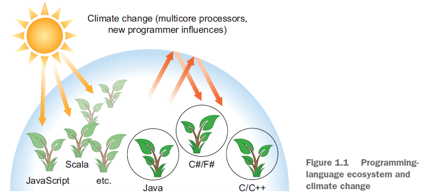

# Chapter 1: Java 8, 9, 10, and 11: what’s happening

Java 一直在演进的根本原因，在于编程语言生态圈的不断发展：

编程语言需要跟上硬件的发展或程序员的期望。为了长久存在，Java 必须通过添加新功能来确保基业长青。这种演进只有在新功能得以推广应用的基础上才是有意义的。因此使用 Java 8 也是在捍卫 Java 程序员的生存之道。

Java 9 的特点在于引入模块的概念（module），或者一个响应式编程的工具包。