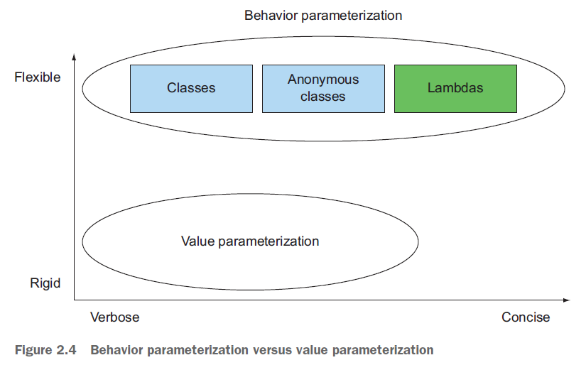

# Chapter 2: Passing code with behavior parameterization


通过行为参数化传递代码段：

```java
public interface ApplePredicate{
	boolean test (Apple apple);
}	
public static List<Apple> filterApples(List<Apple> inventory, ApplePredicate p) {
	List<Apple> result = new ArrayList<>();
	for(Apple apple: inventory) {
		if(p.test(apple)) {
			result.add(apple);
		}
	}
	return result;
}
```

Lambda 表达式在简化代码和代码灵活性方面的努力：



`Callable` 接口——对有返回结果的某个任务的模型描述；相当于升级版的 `Runnable`：

```java
// java.lang.Runnable
public interface Runnable {
	void run();
}

// java.util.concurrent.Callable
public interface Callable<V> {
	V call();
}
```

