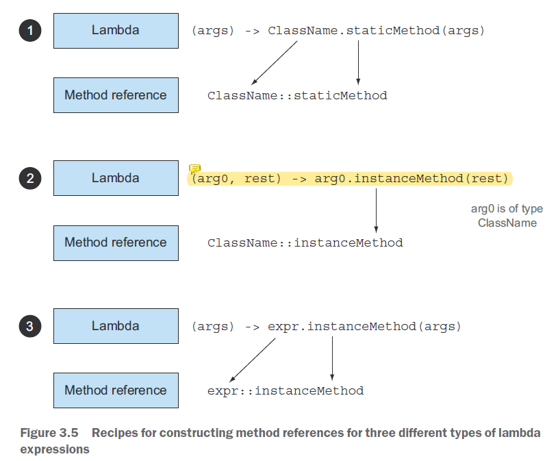

# Chapter 3: Lambda expressions


函数描述符：函数式接口的唯一抽象方法的签名，称为该接口的函数描述符（`function descriptor`，P53），例如：

- `T -> R`
- `(int, int) -> int`
- `T -> void`
- `() -> T`
- `(T, U) -> R`


理解“环绕执行”模式（execute-around pattern，P50）：

```java
// before
public String processFile() throws IOException {
	try (BufferedReader br = new BufferedReader(new FileReader("data.txt"))) {
		return br.readLine();
	}
}

// after
@FunctionalInterface
public interface BufferedReaderProcessor {
	String process(BufferedReader b) throws IOException;
}
public String processFile(BufferedReaderProcessor p) throws IOException {
	try (BufferedReader br = new BufferedReader(new FileReader("data.txt"))) {
		return p.process(br);
	}
}
String oneLine = processFile(br -> br.readLine());
String twoLines = processFile(br -> br.readLine + br.readLine());
```


对于需要抛异常的函数式接口，则需要在函数签名上显式声明（P59），如：

```java
@FunctionalInterface
public interface BufferedReaderProcessor {
	String process(BufferedReader b) throws IOException;
}
BufferedReaderProcessor p = (BufferedReader br) -> br.readLine();
```


> **为什么 Lambda 表达式的捕获变量必须声明为 `final` 或等效 `final`？**
>
> 可以从多线程环境进行理解：（P64）
>
> 简单来说，由于局部变量存储在栈上，而栈上的变量的生命周期是在方法调用期间，一旦方法调用结束，栈上的变量就会被释放。如果一个 Lambda 表达式可以直接访问局部变量，而该 Lambda 表达式同时又在另一个线程中执行，那么当线程后者尝试访问该局部变量时，该变量可能已经被释放，导致访问错误。
>
> 为了解决这个问题，Java采取了一种策略，即将自由局部变量的访问视为对其 **副本** 的访问。这样，在 Lambda 表达式中访问的是变量的副本，而不是原始变量本身。这样做可以避免访问已被释放的变量。
>
> 因此，为了确保线程安全和避免访问已释放的变量，Java 中的 Lambda 表达式对局部变量的访问施加了限制，要求局部变量被标记为 `final` 或等效 `final`，确保其值在 Lambda 表达式内部是不可修改的。


Lambda 表达式和“闭包”类似，但不能划等号。前者只能访问不可修改捕获变量的值，而后者可读也可写。（P64）


三类常见的 Lambda 表达式与方法引用的转换类型（P67）：

