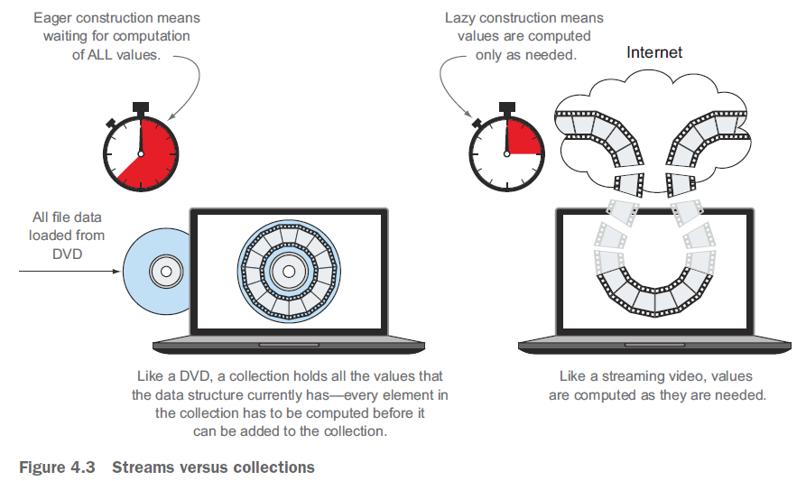

# Ch04 Introducing streams

> `stream` 流的定义：
>
> a sequence of elements from a source that supports data-processing operations.
>
> 流（Stream）是来自支持数据处理操作的源的一个元素序列

流与集合的对比：集合像DVD（全量加载），流像在线视频（按需加载）

上升到哲学层面的不同：

- 集合：在 **空间维度** 展布的一组值 (a set of values spread out in space)
- 流：在 **时间维度** 展布的一组值 (a set of values spread out in time)

流的操作分为两大类：

- 中间操作（Intermediate operations）
- 终止操作（Terminal operations）