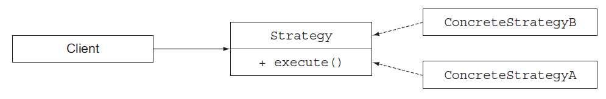
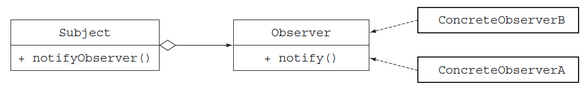
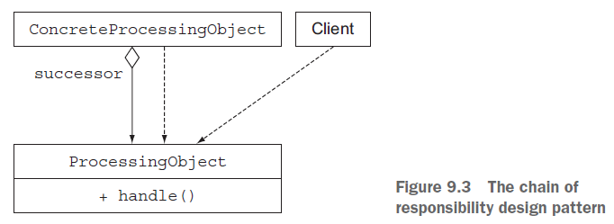

# Ch09 Refactoring, testing, and debugging


## 1 重构

### 1.1 为 Lambda

模板代码用 Lambda 表达式替换：`Runnable r2 = () -> System.out.println("Hello");`

较复杂的 Lambda 逻辑可以改用方法引用：

```java
// Before:
Map<CaloricLevel, List<Dish>> dishesByCaloricLevel = menu.stream()
		.collect(
				groupingBy(dish -> {
					if (dish.getCalories() <= 400) return CaloricLevel.DIET;
					else if (dish.getCalories() <= 700) return CaloricLevel.NORMAL;
					else return CaloricLevel.FAT;
				})
		);

// After:
public CaloricLevel getCaloricLevel() {
    if (this.getCalories() <= 400) return CaloricLevel.DIET;
    else if (this.getCalories() <= 700) return CaloricLevel.NORMAL;
    else return CaloricLevel.FAT;
}
Map<CaloricLevel, List<Dish>> dishesByCaloricLevel = menu.stream()
    	.collect(groupingBy(Dish::getCaloricLevel));
```


### 1.2 重构为 Stream 流操作

```java
// Before:
List<String> dishNames = new ArrayList<>();
for(Dish dish: menu) {
    if(dish.getCalories() > 300){
	    dishNames.add(dish.getName());
    }
}

// After:
menu.parallelStream()
        .filter(d -> d.getCalories() > 300)
        .map(Dish::getName)
        .collect(toList());
```


### 1.3 提高代码灵活性

```java
// Before:
if (logger.isLoggable(Log.FINER)) {
	logger.finer("Problem: " + generateDiagnostic());
}

// After:
logger.log(Level.FINER, "Problem: " + generateDiagnostic());

// Add defer evaluation:
public void log(Level level, Supplier<String> msgSupplier) {
    if(logger.isLoggable(level)){
    	log(level, msgSupplier.get());
    }
}
logger.log(Level.FINER, () -> "Problem: " + generateDiagnostic());
```

点评：让设计细节对用户透明，延迟特性保障按需计算。


### 1.4 执行环绕模式的改进

```java
@FunctionalInterface
public interface BufferedReaderProcessor {
	String process(BufferedReader b) throws IOException;
}

public static String processFile(BufferedReaderProcessor p) throws IOException {
	try(BufferedReader br = new BufferedReader(new
			FileReader("ModernJavaInAction/chap9/data.txt"))) {
		return p.process(br);
	}
}

String oneLine = processFile((BufferedReader b) -> b.readLine());
String twoLines = processFile((BufferedReader b) -> b.readLine() + b.readLine());
```


### 1.5 五类面向对象编程设计模式的优化重构

#### 1.5.1 策略模式

策略模式示意图：



传统模式举例：

```java
// strategy interface
public interface ValidationStrategy {
	boolean execute(String s);
}
// two implementations
public class IsAllLowerCase implements ValidationStrategy {
	public boolean execute(String s){
		return s.matches("[a-z]+");
	}
}
public class IsNumeric implements ValidationStrategy {
	public boolean execute(String s){
		return s.matches("\\d+");
	}
}
// Define client class
public class Validator {
    private final ValidationStrategy strategy;
    public Validator(ValidationStrategy v) {
    	this.strategy = v;
    }
    public boolean validate(String s) {
	    return strategy.execute(s);
    }
}
// Test cases
Validator numericValidator = new Validator(new IsNumeric());
boolean b1 = numericValidator.validate("aaaa");
Validator lowerCaseValidator = new Validator(new IsAllLowerCase ());
boolean b2 = lowerCaseValidator.validate("bbbb");
```

改造后：

```java
@FunctionalInterface
public interface ValidationStrategy {
	boolean execute(String s);
}
// Define client class
public class Validator {
    private final ValidationStrategy strategy;
    public Validator(ValidationStrategy v) {
    	this.strategy = v;
    }
    public boolean validate(String s) {
	    return strategy.execute(s);
    }
}
// Use lambda expressions instead of sub-class implementations
Validator numericValidator = new Validator((String s) -> s.matches("[a-z]+"));
boolean b1 = numericValidator.validate("aaaa");
Validator lowerCaseValidator = new Validator((String s) -> s.matches("\\d+"));
boolean b2 = lowerCaseValidator.validate("bbbb");
```


#### 1,5.2 模板方法

```java
// Before:
abstract class OnlineBanking {
    public void processCustomer(int id){
        Customer c = Database.getCustomerWithId(id);
        makeCustomerHappy(c);
    }
	abstract void makeCustomerHappy(Customer c);
}
// After:
public void processCustomer(int id, Consumer<Customer> makeCustomerHappy) {
    Customer c = Database.getCustomerWithId(id);
    makeCustomerHappy.accept(c);
}
new OnlineBankingLambda().processCustomer(1337, c -> System.out.println("Hello " + c.getName());
```


#### 1.5.3 观察者模式

示意图：



实例：

```java
// interface 1
interface Observer {
	void notify(String tweet);
}
// 3 implementations
class NYTimes implements Observer {
    public void notify(String tweet) {
    	if(tweet != null && tweet.contains("money")){
            System.out.println("Breaking news in NY! " + tweet);
        }
    }
}
class Guardian implements Observer {
    public void notify(String tweet) {
        if(tweet != null && tweet.contains("queen")){
            System.out.println("Yet more news from London... " + tweet);
        }
    }
}
class LeMonde implements Observer {
    public void notify(String tweet) {
        if(tweet != null && tweet.contains("wine")){
        	System.out.println("Today cheese, wine and news! " + tweet);
        }
    }
}
// interface 1
interface Subject {
    void registerObserver(Observer o);
    void notifyObservers(String tweet);
}
// 1 implementation
class Feed implements Subject {
    private final List<Observer> observers = new ArrayList<>();
    public void registerObserver(Observer o) {
    	this.observers.add(o);
    }
    public void notifyObservers(String tweet) {
    	observers.forEach(o -> o.notify(tweet));
    }
}

// Test cases:
Feed f = new Feed();
f.registerObserver(new NYTimes());
f.registerObserver(new Guardian());
f.registerObserver(new LeMonde());
f.notifyObservers("The queen said her favourite book is Modern Java in Action!");

// Lambda expression approach: (no need to implement 3 sub-classes)
f.registerObserver((String tweet) -> {
    if(tweet != null && tweet.contains("money")){
    	System.out.println("Breaking news in NY! " + tweet);
    }
});
f.registerObserver((String tweet) -> {
    if(tweet != null && tweet.contains("queen")){
    	System.out.println("Yet more news from London... " + tweet);
    }
});
f.registerObserver((String tweet) -> {
    if(tweet != null && tweet.contains("wine")){
    	System.out.println("Today cheese, wine and news! " + tweet);
    }
});
f.notifyObservers("The queen said her favourite book is Modern Java in Action!");
```


#### 1.5.4 责任链模式

示意图：



实例：

```java
// Declare 1 abstract class
public abstract class ProcessingObject<T> {
    protected ProcessingObject<T> successor;
    public void setSuccessor(ProcessingObject<T> successor){
    	this.successor = successor;
    }
    
    public T handle(T input) {
        T r = handleWork(input);
        if(successor != null){
            return successor.handle(r);
        }
	    return r;
    }
    
    abstract protected T handleWork(T input);
}
// 2 implementations:
public class HeaderTextProcessing extends ProcessingObject<String> {
    public String handleWork(String text) {
	    return "From Raoul, Mario and Alan: " + text;
    }
}
public class SpellCheckerProcessing extends ProcessingObject<String> {
    public String handleWork(String text) {
	    return text.replaceAll("labda", "lambda");
    }
}
// Test cases:
ProcessingObject<String> p1 = new HeaderTextProcessing();
ProcessingObject<String> p2 = new SpellCheckerProcessing();
p1.setSuccessor(p2);
String result = p1.handle("Aren't labdas really sexy?!!");
System.out.println(result);
```

用函数式编程思想进行重构，其实就是多个 Lambda 表达式的组合：

```java
@FunctionalInterface
public interface MyChainNew<T> {
    T handle(T input);
    default MyChainNew<T> andThen(MyChainNew<T> after) {
        Objects.requireNonNull(after);
        return t -> after.handle(handle(t));
    }
}

class Demo2 {
    public static void main(String[] args) {
        MyChainNew<String> task1 = input -> "From Raoul, Mario and Alan: " + input;
        MyChainNew<String> task2 = input -> input.replaceAll("labda", "lambda");
        String result = task1
                .andThen(task2)
                .handle("Aren't labdas really sexy?!!");
        System.out.println(result);
    }
}
```


#### 1.5.5 工厂模式

```java
public class ProductFactory {
    public static Product createProduct(String name) {
	    switch(name){
             case "loan": return new Loan();
             case "stock": return new Stock();
             case "bond": return new Bond();
             default: throw new RuntimeException("No such product " + name);
        }
    }
}
Product p = ProductFactory.createProduct("loan");
```

使用 Lambda 表达式重构：

```java
final static Map<String, Supplier<Product>> map = new HashMap<>();
static {
    map.put("loan", Loan::new);
    map.put("stock", Stock::new);
    map.put("bond", Bond::new);
}
public static Product createProduct(String name){
    Supplier<Product> p = map.get(name);
    if(p != null) return p.get();
    throw new IllegalArgumentException("No such product " + name);
}
```

如果需要多个参数，则需自定义函数式接口：

```java
public interface TriFunction<T, U, V, R> {
	R apply(T t, U u, V v);
}
Map<String, TriFunction<Integer, Integer, String, Product>> map = new HashMap<>();
```


## 2 测试

对于 Lambda 表达式的测试，只能将重心放在具体行为上（结果上）。

再者，可以将复杂的 Lambda 逻辑重构为单个方法，或拆解为多个子表达式、子方法。

对于高阶 Lambda 表达式的测试，也只能从最终结果进行测试，对 Lambda 表达式本身进行测试是没有意义的。


## 3 调试

两种常见的调试方法：

- 检查堆栈信息
- 检查日志

靠堆栈信息来调试 Lambda 表达式较困难，提示信息并不明显；可以考虑转为特定的 **方法调用**（注意，不是 **方法引用**），但局限性较大。

从日志的角度进行调试，可以采用 `Stream` 流提供的接口方法 `peek`：

```java
List<Integer> numbers = Arrays.asList(2, 3, 4, 5);
numbers.stream()
        .map(x -> x + 17)
        .filter(x -> x % 2 == 0)
        .limit(3)
        .forEach(System.out::println);
// debug with peek
List<Integer> result =
numbers.stream()
        .peek(x -> System.out.println("from stream: " + x))
        .map(x -> x + 17)
        .peek(x -> System.out.println("after map: " + x))
        .filter(x -> x % 2 == 0)
        .peek(x -> System.out.println("after filter: " + x))
        .limit(3)
        .peek(x -> System.out.println("after limit: " + x))
        .collect(toList());
/* Result:
from stream: 2
after map: 19
from stream: 3
after map: 20
after filter: 20
after limit: 20
from stream: 4
after map: 21
from stream: 5
after map: 22
after filter: 22
after limit: 22
*/
```

