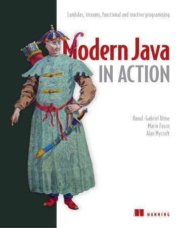

# 《Modern Java in Action》Learning Notes


## 1. Profiles



|    **Title**    |  **Modern Java in Action** [ISBN: 9781617293566]  |
| :-------------: | :-----------------------------------------------: |
|   **Author**    | **Raoul-Gabriel Urma, Mario Fusco, Alan Mycroft** |
| **Publication** |                **Manning, 2018.9**                |
|    **Pages**    |                      **592**                      |

> **Introduction**
>
> *Modern Java in Action* connects new features of the Java language with their practical applications. Using crystal-clear examples and careful attention to detail, this book respects your time. It will help you expand your existing knowledge of core Java as you master modern additions like the Streams API and the Java Module System, explore new approaches to concurrency, and learn how functional concepts can help you write code that’s easier to read and maintain.
>
> **what's inside**
>
> - Thoroughly revised edition of Manning’s bestselling *Java 8 in Action*
> - New features in Java 8, Java 9, and beyond
> - Streaming data and reactive programming
> - The Java Module System
>
> **about the reader**
>
> Written for developers familiar with core Java features.
>
> **about the authors**
>
> **Raoul-Gabriel Urma** is CEO of Cambridge Spark. **Mario Fusco** is a senior software engineer at Red Hat. **Alan Mycroft** is a University of Cambridge computer science professor; he co-founded the Raspberry Pi Foundation.


## 2. Outlines

Status available：:heavy_check_mark: (Completed) | :hourglass_flowing_sand: (Working) | :no_entry: (Not Started) | :orange_book: (Finish reading)

|      |                     Part I Fundamentals                      |                          |
| :--: | :----------------------------------------------------------: | :----------------------: |
| Ch01 |    [Java 8, 9, 10, and 11: what’s happening?](./Ch01.md)     |    :heavy_check_mark:    |
| Ch02 |   [Passing code with behavior parameterization](./Ch02.md)   |    :heavy_check_mark:    |
| Ch03 |               [Lambda expressions](./Ch03.md)                |    :heavy_check_mark:    |
|      |  **Part II Functional-style data processing with streams**   |                          |
| Ch04 |               [Introducing streams](./Ch04.md)               |    :heavy_check_mark:    |
| Ch05 |              [Working with streams](./Ch05.md)               |    :heavy_check_mark:    |
| Ch06 |          [Collecting data with streams](./Ch06.md)           |    :heavy_check_mark:    |
| Ch07 |    [Parallel data processing and performance](./Ch07.md)     | :hourglass_flowing_sand: |
|      | **Part III Effective programming with streams and lambdas**  |                          |
| Ch08 |           [Collection API enhancements](./Ch08.md)           |        :no_entry:        |
| Ch09 |       [Refactoring, testing, and debugging](./Ch09.md)       |        :no_entry:        |
| Ch10 |     [Domain-specific languages using lambdas](./Ch10.md)     |        :no_entry:        |
|      |                  **Part IV Everyday Java**                   |                          |
| Ch11 | [Using Optional as a better alternative to null](./Ch11.md)  |        :no_entry:        |
| Ch12 |              [New Date and Time API](./Ch12.md)              |        :no_entry:        |
| Ch13 |                 [Default methods](./Ch13.md)                 |        :no_entry:        |
| Ch14 |             [The Java Module System](./Ch14.md)              |        :no_entry:        |
|      |             **Part V Enhanced Java concurrency**             |                          |
| Ch15 | [Concepts behind CompletableFuture and reactive programming](./Ch15.md) |        :no_entry:        |
| Ch16 | [CompletableFuture: composable asynchronous programming](./Ch16.md) |        :no_entry:        |
| Ch17 |              [Reactive programming](./Ch17.md)               |        :no_entry:        |
|      | **Part VI Functional programming and future Java evolution** |                          |
| Ch18 |              [Thinking functionally](./Ch18.md)              |        :no_entry:        |
| Ch19 |        [Functional programming techniques](./Ch19.md)        |        :no_entry:        |
| Ch20 |  [Blending OOP and FP: Comparing Java and Scala](./Ch20.md)  |        :no_entry:        |
| Ch21 |       [Conclusions and where next for Java](./Ch21.md)       |        :no_entry:        |


Powershell script for generating markdown files in batch:

```powershell
# Create 21 empty markdown files named Ch##.md:
for($i=1; $i -le 21; $i=$i+1){ New-Item -Name "Ch$('{0:d2}' -f $i).md"; }
```

 
